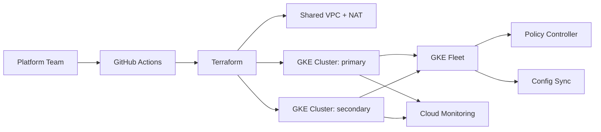

# tf-gke-management

Terraform reference implementation for a multi-cluster Google Kubernetes Engine management platform.

This repository showcases the infrastructure patterns behind the featured work **Multi-Cluster GKE Platform Modernisation**: private regional GKE clusters, Fleet registration, Workload Identity, shared networking, policy guardrails, observability hooks, and GitOps-ready cluster bootstrap.

## What This Demonstrates

- Modular Terraform for repeatable GKE landing zones.
- Private, regional clusters with hardened control-plane access.
- Dedicated VPC, secondary ranges, Cloud NAT, and firewall baselines.
- GKE Fleet membership for multi-cluster governance.
- Workload Identity bindings for least-privilege platform services.
- Policy Controller and Config Sync-ready structure.
- CI validation with formatting, validation, TFLint, and Checkov.
- Operational runbooks for upgrades, incident response, and cluster onboarding.

## Repository Layout

```text
.
├── .github/workflows/        # CI quality gates for Terraform and policy checks
├── docs/                     # Architecture decisions and operational runbooks
├── examples/                 # Copyable cluster and team onboarding examples
├── live/                     # Environment compositions: dev, stage, prod
├── modules/                  # Reusable Terraform platform modules
├── policies/                 # OPA/Gatekeeper-style platform policies
└── scripts/                  # Local validation helpers
```

## Architecture



## Quick Start

Prerequisites:

- Terraform `>= 1.7`
- Google Cloud SDK authenticated with appropriate permissions
- TFLint with the Google ruleset
- Checkov

```bash
gcloud auth application-default login
make init ENV=dev
make validate ENV=dev
make plan ENV=dev
```

Copy `live/dev/terraform.tfvars.example` to `live/dev/terraform.tfvars` and replace placeholder values before planning against a real Google Cloud project.

## Design Principles

- **Environment composition over copy-paste:** each environment wires reusable modules with explicit inputs.
- **Secure defaults:** private nodes, Workload Identity, shielded nodes, Binary Authorization-ready settings, and restricted API access.
- **Operational clarity:** runbooks and examples are treated as first-class platform deliverables.
- **Separation of concerns:** networking, IAM, GKE, Fleet, and observability can evolve independently.

## Status

This is portfolio-grade infrastructure code intended to demonstrate platform engineering approach and repository structure. Review IAM roles, subnet CIDRs, organization policies, and security requirements before applying in a production estate.
